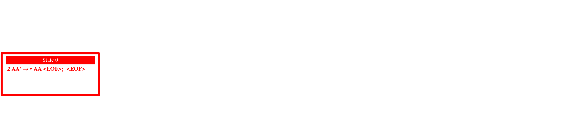

SWP (Some Weird Parsers)
========================

This project started as a testbed for parsing related algorithms I learned in an university course.

It doesn't aim to be a replacement for ANTLR or bison,
but helps to understand the principles behind these tools.

Features
--------
* Create grammars using an EBNF like syntax
* Create lexers (and their automaton table) using an regular expression like syntax
* Create LR and LARL parsers:
    * create GIFs and MP4 of the construction of their automatons
    * use them to parse real grammars (the EBNF and regex parsing is implemented this way)
* Basic generation of Early and LL(1) parsers
* It has zero dependencies and is written in Java 8 style code

Example GIF
-----------
The following gif is a construction GIF for the LARL automaton of the grammar
`AA → ( AA ), AA → c`:
 

This branch contains the nildumu project (part of my master thesis)
as a sub package.

It's licensed under the GPLv3 and MIT license.